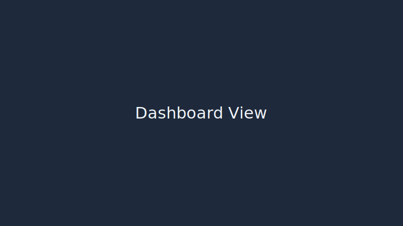
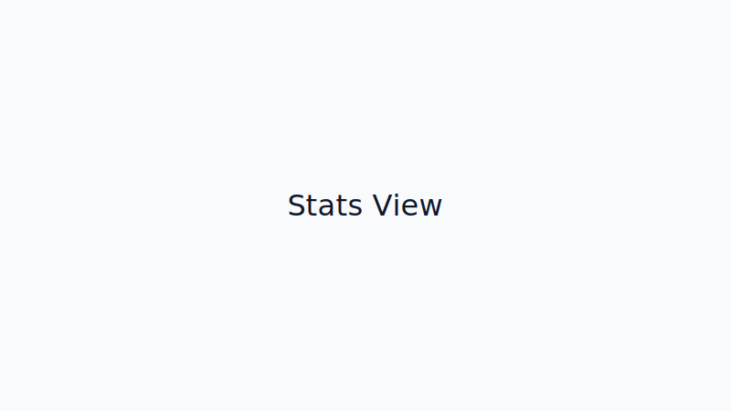
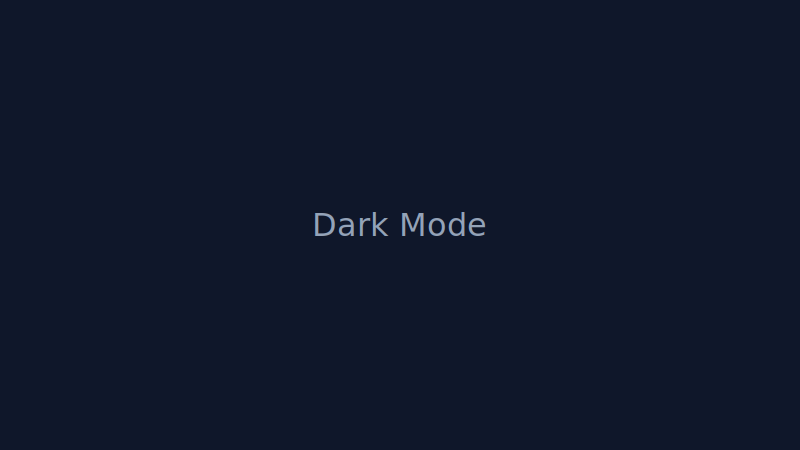

# Futsal Scoreboard

A modern React + TypeScript scoreboard for tracking futsal matches with a polished interface.

## Feature Overview
- Real-time game dashboard with configurable teams, timer, and match presets
- Dark mode styling that adapts to system preferences
- Animated transitions for scores, timer, and live indicators
- Route-based views for dashboard, scoreboard, statistics, and overlays
- Progressive Web App (PWA) support so the app can be installed on devices
- Detailed stats tracker with shot accuracy, cards, and corner tracking
- Customizable keyboard shortcuts for switching ball possession
- External timer control options: keyboard shortcuts, hardware integration, and a mobile remote at `/#/remote`

## Screenshots





## Setup
1. Install dependencies:
   ```bash
   npm install
   ```
2. Start the development server:
   ```bash
   npm run dev
   ```

## Development Scripts
- `npm run dev` – Start a Vite-powered development server with hot reloading
- `npm run build` – Bundle the app for production into the `dist` directory
- `npm run lint` – Run ESLint over the source files
- `npm run preview` – Preview the production build locally

## Deployment
1. Build the project:
   ```bash
   npm run build
   ```
2. Deploy the contents of the `dist` folder to any static hosting service (e.g., Netlify, Vercel, GitHub Pages).
3. Ensure your hosting redirects all unknown paths to `index.html` (a `_redirects` file is provided for Netlify-style hosts).
4. The PWA manifest and service worker are included in the build, enabling offline support and install prompts.

## Using the New Capabilities
### Dark Mode
The UI automatically follows your system theme. Switch your operating system or browser to dark mode to experience the darker palette.

### Routes
Navigate between the dashboard, scoreboard, stats tracker, and overlay views using the on-screen controls or by visiting the respective routes (`/dashboard`, `/scoreboard`, `/stats`, `/overlay`).

To operate the timer from another device, open `/#/remote` on a device connected to the same network.

### Browser Source Overlay
Load `/#/overlay` in OBS, Yololiv, or any browser source to display a transparent scoreboard and optional stats without any control UI.

### Animations
Key interface elements such as the live indicator and score updates use smooth animations to improve readability. These animations are powered by Tailwind CSS utility classes.

## Progressive Web App
On supported browsers, use the "Install" or "Add to Home Screen" option to install the app. Once installed, it can run offline and launch in a standalone window.

